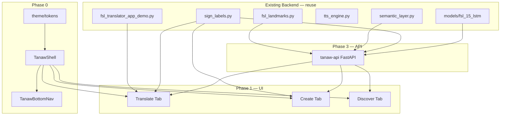

# TANAW Mobile — Implementation Plan

> Updated after latest pull (`5deeb15` — demo app, Tagalog labels/TTS, green skeleton overlay).  
> Aligns the [Figma mobile design](https://www.figma.com/design/HMdCplbVWx6qHXtE0CGSir/TANAW--Copy-) with the **current Codewarts Python backend**.

---

## 1. Executive summary

**TANAW** is a mobile app for real-time FSL → Tagalog translation, crowd-sourced sign capture, and community discovery.

**Current repo reality (post-pull):**

| Area | Status |
|------|--------|
| Mobile frontend (`apps/tanaw-mobile`) | **Not started** — prior Next.js web scaffold was added then **reverted** (`7eef25f`) |
| Tagalog semantic layer | **Done** — `semantic_layer.py` outputs natural Tagalog via Gemini |
| Tagalog display labels | **Done** — `sign_labels.py` maps 15 model keys → Tagalog |
| Tagalog TTS | **Done** — `tts_engine.py` (edge-tts `fil-PH-*` voices) |
| Primary ML model | **15-sign LSTM** — `models/fsl_15_lstm/` (not the legacy 105-sign model) |
| Landmark pipeline | **Extracted** — `fsl_landmarks.py` (`HolisticTracker`, `KEYPOINT_DIM = 258`) |
| Demo / pitch mode | **Done** — `fsl_translator_app_demo.py` (6 scripted scenarios) |
| Desktop reference app | **Active** — `fsl_translator_app.py` |

**Strategy:** Component-driven mobile UI + contract-first API. Reuse existing Python modules (`fsl_landmarks`, `sign_labels`, `semantic_layer`, `tts_engine`) behind a thin FastAPI layer. Build Expo UI from Figma frame URLs via Figma MCP.

---

## 2. What changed since the original plan

### Added (reuse in TANAW)

| Module | Purpose | Mobile impact |
|--------|---------|---------------|
| `sign_labels.py` | `ENGLISH_KEYS`, `TAGALOG_BY_KEY`, `to_tagalog()` | Display contract for Translate + Create challenges |
| `semantic_layer.py` | Gemini → Tagalog (`TANAW_GEMINI_MODEL`) | `/inference/translate` — **no prompt rewrite needed** |
| `tts_engine.py` | `TagalogTTS` with edge-tts / gTTS / pyttsx3 | Server TTS optional; mobile uses `expo-speech` |
| `fsl_landmarks.py` | MediaPipe Tasks holistic tracker | Inference API imports directly |
| `fsl_translator_app_demo.py` | 6 demo states, staggered sign reveal | **UX reference** for Translate tab mocks |
| `models/fsl_15_lstm/` | `fsl_15_model.h5`, `scaler.pkl`, `action_labels_15.npy` | Production inference vocabulary |
| `models/holistic_landmarker.task` | Bundled MediaPipe model | Same asset for API deployment |

### Removed / deprecated

| Item | Notes |
|------|-------|
| `fsl_translator_app_v2.py` | Deleted — single canonical desktop app |
| `models/fsl_105_model.h5` | Removed from repo — docs still mention 105; **code uses 15-sign model** |
| `frontend/` Next.js scaffold | Reverted — do **not** resurrect; mobile target is **Expo**, not web |
| `COMPLETE_TRAINING_PIPELINE.ipynb` | Removed — training via Colab notebooks |

### Desktop app constants (port to API)

From `fsl_translator_app.py`:

```
SEQUENCE_LENGTH = 30
KEYPOINT_DIM = 258
PREDICTION_CONFIDENCE_THRESHOLD = 0.70
STABLE_FRAMES_TO_RECORD = 10
SIGN_COOLDOWN_FRAMES = 12
GEMINI_DEBOUNCE_SEC = 0.8
INFERENCE_EVERY_N_FRAMES = 2
```

`StableSignDetector` and `append_sign_no_spam` should be shared logic in the API layer.

---

## 3. Current 15-sign vocabulary

Model keys (`models/fsl_15_lstm/action_labels_15.npy`):

```
GOOD_AFTERNOON, NICE_TO_MEET_YOU, YES, NO, THANK_YOU, HOW_ARE_YOU,
ONE, TWO, THREE, SIX, SEVEN, CORRECT, WRONG, IM_FINE, UNDERSTAND
```

Tagalog mapping lives in `sign_labels.TAGALOG_BY_KEY`. Use this as the **source of truth** for:

- Translate tab live labels
- Create tab challenge prompts (initial challenges = this vocabulary)
- Discover feed seed content

**Demo scenarios** (`fsl_translator_app_demo.py`) — useful mock flows for Translate UI:

| # | Signs | Example Tagalog output |
|---|-------|------------------------|
| 1 | `HELLO` | Hello |
| 2 | `GOOD_AFTERNOON`, `NICE_TO_MEET_YOU` | Magandang hapon. Ikinagagalak ko kayo makilala. |
| 3 | `YES` | Oo. |
| 4 | `NO` | Hindi. |
| 5 | `ONE`, `TWO`, `THREE` | Isa. Dalawa. Tatlo. |
| 6 | `SIX`, `SEVEN` | Anim. Pito. |

---

## 4. Target architecture

```
┌─────────────────────────────────────────────────────────────┐
│  apps/tanaw-mobile (NEW)                                    │
│  Expo Router + TypeScript + NativeWind                      │
│  ┌─────────┐  ┌─────────┐  ┌──────────────────────────┐    │
│  │Translate│  │ Create  │  │ Discover (grid + immersive)│   │
│  └────┬────┘  └────┬────┘  └────────────┬─────────────┘    │
│       │            │                     │                   │
│       └────────────┴─────────────────────┘                   │
│                    │ contracts/ + services/                  │
└────────────────────┼────────────────────────────────────────┘
                     │ HTTP / WebSocket
┌────────────────────▼────────────────────────────────────────┐
│  services/tanaw-api (NEW) — FastAPI                           │
│  ┌──────────────┐ ┌──────────────┐ ┌────────────────────┐  │
│  │ inference.py │ │submissions.py│ │ discover.py        │  │
│  └──────┬───────┘ └──────┬───────┘ └─────────┬──────────┘  │
│         │                │                    │              │
│  ┌──────▼────────────────▼────────────────────▼──────────┐ │
│  │ Existing Python modules (import, don't rewrite)         │ │
│  │ fsl_landmarks · sign_labels · semantic_layer · model  │ │
│  └───────────────────────────────────────────────────────┘ │
└─────────────────────────────────────────────────────────────┘
```

**Stack decisions**

| Layer | Choice | Rationale |
|-------|--------|-----------|
| Mobile | Expo SDK 52+ · Expo Router · TypeScript | Camera, video, TTS, iOS/Android |
| Styling | NativeWind (Tailwind) | Maps to Figma hex tokens |
| Client state | Zustand + TanStack Query | UI state + API cache |
| API | FastAPI in `services/tanaw-api/` | Wraps existing Python ML |
| Contracts | OpenAPI → `openapi-typescript` | Contract-first per spec |
| Figma → code | `get_design_context` per frame URL | One screen per implementation task |

**Environment variables (existing)**

| Variable | Used by |
|----------|---------|
| `GEMINI_API_KEY` | `semantic_layer.py` |
| `TANAW_GEMINI_MODEL` | Default `gemini-2.5-flash` |
| `TTS_VOICE` | Default `fil-PH-BlessicaNeural` |

---

## 5. Design tokens

Strict palette from product spec + Figma:

| Token | Hex | Usage |
|-------|-----|-------|
| `forestGreen` | `#014421` | Bottom nav, Speak button, headers, active filters |
| `pomeloWhite` | `#F9FFE3` | App background, cards, active tab pill |
| `charcoal` | `#1A1A1A` | Body text, high-contrast labels |
| `recordRed` | Confirm in Figma | Create tab shutter button |

**Layout:** Design at **402×874** (iPhone reference). Use safe areas on real devices.

**Typography:**

- Brand: serif/display for "TANAW" wordmark
- UI: sans-serif for badges, translations, overlays

Implement once in `apps/tanaw-mobile/theme/tokens.ts` + `tailwind.config.js`. No raw hex in components.

---

## 6. Proposed repository structure

```
Codewarts/
├── apps/
│   └── tanaw-mobile/              # NEW
│       ├── app/
│       │   ├── (tabs)/
│       │   │   ├── _layout.tsx    # Shell + bottom nav
│       │   │   ├── translate.tsx
│       │   │   ├── create.tsx
│       │   │   └── discover/
│       │   │       ├── index.tsx  # Grid (node 3:36)
│       │   │       └── [id].tsx   # Immersive (node 3:6)
│       │   └── _layout.tsx
│       ├── components/
│       │   ├── shell/             # AppBar, BottomNav
│       │   ├── translate/         # TranslationCard, SpeakButton, CameraToggle
│       │   ├── create/            # ChallengeCard, RecordShutter
│       │   └── discover/          # FilterPills, ContributionCard, VideoFeed
│       ├── theme/tokens.ts
│       ├── contracts/             # TS types (mirror OpenAPI)
│       ├── mocks/                 # Demo scenarios from fsl_translator_app_demo.py
│       └── services/              # API clients
├── services/
│   └── tanaw-api/                 # NEW
│       ├── main.py
│       ├── routes/
│       │   ├── inference.py
│       │   ├── submissions.py
│       │   └── discover.py
│       └── core/
│           ├── detector.py        # StableSignDetector (from desktop app)
│           └── labels.py          # re-export sign_labels
├── fsl_landmarks.py               # existing
├── sign_labels.py                 # existing
├── semantic_layer.py              # existing (Tagalog)
├── tts_engine.py                  # existing (server-side TTS optional)
├── fsl_translator_app.py          # existing desktop reference
├── fsl_translator_app_demo.py     # existing demo reference
└── models/fsl_15_lstm/            # existing production model
```

---

## 7. App shell (all tabs)

Every main view inherits:

```
┌─────────────────────────────┐
│  TANAW          (AppBar)    │  pomeloWhite bg · forestGreen logo
├─────────────────────────────┤
│      Tab content slot       │
├─────────────────────────────┤
│ Translate │ Create │ Discover│  forestGreen bar · cream icons
└─────────────────────────────┘
```

**Components:** `TanawShell` · `TanawAppBar` · `TanawBottomNav`

Active tab: lighter `pomeloWhite` pill / high-contrast highlight on `forestGreen` bar.

---

## 8. Screen breakdowns + Figma URLs

| Screen | Figma node | URL |
|--------|------------|-----|
| Translate | `1:4` | [Translate tab](https://www.figma.com/design/HMdCplbVWx6qHXtE0CGSir/TANAW--Copy-?node-id=1-4) |
| Create | `2:55` | [Create tab](https://www.figma.com/design/HMdCplbVWx6qHXtE0CGSir/TANAW--Copy-?node-id=2-55) |
| Discover grid | `3:36` | [Community grid](https://www.figma.com/design/HMdCplbVWx6qHXtE0CGSir/TANAW--Copy-?node-id=3-36) |
| Discover immersive | `3:6` | [Vertical player](https://www.figma.com/design/HMdCplbVWx6qHXtE0CGSir/TANAW--Copy-?node-id=3-6) |

**Figma MCP workflow (per screen):**

1. `get_design_context` — `fileKey: HMdCplbVWx6qHXtE0CGSir`, `nodeId: 1:4` (etc.)
2. Compare screenshot to spec tokens
3. Extract reusable components
4. Download assets → `apps/tanaw-mobile/assets/figma/`
5. Implement with token references only

---

### 8.1 Translate tab

**Purpose:** Live camera + FSL → Tagalog overlay.

| UI component | Notes |
|--------------|-------|
| `CameraViewport` | `expo-camera` full-screen |
| `TranslationCard` | Lower-third floating card (`pomeloWhite`) |
| `LanguageBadge` | "FSL to Tagalog" + green dot |
| `LiveTranslationText` | Bold Tagalog (e.g. "Magandang Umaga!") |
| `SpeakTranslationButton` | Forest green pill + speaker icon |
| `CameraToggleButton` | Circular switch (maps to desktop `show_bones` toggle concept) |

**Data contract:**

```ts
interface TranslateSession {
  mode: 'fsl-to-tagalog';
  liveSignKey: string | null;       // e.g. "THANK_YOU"
  liveSignTagalog: string;          // from sign_labels.to_tagalog
  transcript: string;               // semantic_layer output
  signsDetected: string[];          // English keys, ordered
  isSpeaking: boolean;
}
```

**Backend mapping:** Port `StableSignDetector`, `prepare_model_input`, `SemanticInterpreter.interpret()`. Live label uses `to_tagalog(sign)` (same as desktop `label_display`).

**TTS:** `expo-speech` with Filipino locale on mobile. Server can optionally expose `/tts` using `TagalogTTS` for consistent voice.

**Dev mock:** Wire `DEMO_SCENARIOS` from `fsl_translator_app_demo.py` as `mocks/translate-demo.ts` for UI testing without camera/API.

---

### 8.2 Create tab

**Purpose:** Crowd-sourced sign video capture for dataset expansion.

| UI component | Notes |
|--------------|-------|
| `ChallengePromptCard` | Upper-third floating card |
| `ChallengeBadge` | "DO THIS SIGN" + status icon |
| `SignChallengeLabel` | Target meaning + illustration |
| `RecordShutterButton` | Large red center button |

**Data contract:**

```ts
interface SignChallenge {
  id: string;
  key: string;              // ENGLISH_KEYS entry
  labelTagalog: string;     // sign_labels.to_tagalog(key)
  illustrationUrl?: string;
}

interface SubmissionPayload {
  challengeId: string;
  signKey: string;
  videoUri: string;
  contributorId: string;
  contributorName: string;
  durationMs: number;
}
```

**Backend:** `POST /submissions` (multipart). Feeds into existing `video-processing/` pipeline for retraining.

**Initial challenges:** Rotate through `sign_labels.ENGLISH_KEYS`.

---

### 8.3 Discover — grid

**Purpose:** Community contributions dashboard.

| UI component | Notes |
|--------------|-------|
| `SectionHeader` | "COMMUNITY CONTRIBUTIONS" |
| `CategoryFilterCarousel` | All · Phrases · Greetings |
| `ContributionGrid` | 2×2 grid |
| `ContributionCard` | Thumbnail + sign label + contributor |

**Data contract:**

```ts
interface Contribution {
  id: string;
  signKey: string;
  signLabelTagalog: string;
  contributorName: string;    // e.g. "Jodimeer Ammang"
  category: 'all' | 'phrases' | 'greetings';
  thumbnailUrl: string;
  videoUrl: string;
}
```

Tap card → `/discover/[id]`.

---

### 8.4 Discover — immersive

**Purpose:** TikTok-style vertical video feed.

| UI component | Notes |
|--------------|-------|
| `VerticalVideoPlayer` | `expo-av` full-screen |
| `ContributorOverlay` | Bottom-left: name + FSL definition |
| `SwipeFeedContainer` | Vertical paging between contributions |

---

## 9. API contracts

Define OpenAPI **before** ML wiring. Mobile starts with mocks matching these shapes.

| Endpoint | Method | Purpose |
|----------|--------|---------|
| `/health` | GET | Service + model readiness |
| `/labels` | GET | `ENGLISH_KEYS` + Tagalog map |
| `/inference/session` | POST | Start session → `sessionId` |
| `/inference/frame` | POST | Landmark batch or encoded frame |
| `/inference/translate` | POST | `signs: string[]` → Tagalog transcript |
| `/tts` | POST | Optional server TTS (wraps `TagalogTTS`) |
| `/submissions` | POST | Upload challenge video |
| `/discover/feed` | GET | Paginated contributions |
| `/discover/{id}` | GET | Single contribution |

**Inference recommendation:** Server-first (reuse `fsl_landmarks.py` + `.h5` model). On-device TFLite is a future optimization.

---

## 10. Implementation phases

### Phase 0 — Foundation

**Goal:** Mobile scaffold + design system + navigation shell.

- [ ] Create `apps/tanaw-mobile` (Expo Router + NativeWind + TypeScript)
- [ ] Add `theme/tokens.ts` and Tailwind config (`#014421`, `#F9FFE3`, `#1A1A1A`)
- [ ] Build `TanawShell`, `TanawAppBar`, `TanawBottomNav`
- [ ] Tab routes: Translate / Create / Discover
- [ ] Figma MCP inventory pass on all 4 nodes (`1:4`, `2:55`, `3:36`, `3:6`)
- [ ] Add `mocks/translate-demo.ts` from `DEMO_SCENARIOS`

**Exit criteria:** All tabs navigable; shell matches Figma colors; demo mocks loadable.

---

### Phase 1 — UI with mocks (no backend)

**Goal:** Pixel-close screens using static/demo data.

| Order | Screen | Mock source |
|-------|--------|-------------|
| 1 | Translate | `DEMO_SCENARIOS` + `sign_labels` |
| 2 | Create | `ENGLISH_KEYS[0]` as "I Love You" style challenge |
| 3 | Discover grid | 4 hardcoded `Contribution` items |
| 4 | Discover immersive | 3 videos, vertical swipe |

**Exit criteria:** All 4 Figma screens implemented; Speak button triggers `expo-speech` with mock Tagalog text.

---

### Phase 2 — Device capabilities

**Goal:** Real camera, record, and playback — inference still mocked.

- [ ] Camera permissions + preview (Translate + Create)
- [ ] `expo-speech` Filipino TTS on Speak button
- [ ] Video recording on Create shutter (`expo-camera` or `expo-image-picker`)
- [ ] `expo-av` playback on Discover immersive
- [ ] Optional: skeleton overlay toggle (reference desktop `show_bones`)

**Exit criteria:** End-to-end device flows work; translation text still from mocks/demo sequencer.

---

### Phase 3 — API + contracts

**Goal:** FastAPI service wrapping existing Python modules.

- [ ] Scaffold `services/tanaw-api`
- [ ] `GET /labels` — expose `sign_labels`
- [ ] `GET /discover/feed` — seed JSON/SQLite data
- [ ] `POST /submissions` — local file storage
- [ ] OpenAPI spec + generated TS types in mobile `contracts/`
- [ ] TanStack Query hooks in mobile services

**Exit criteria:** Discover feed from API; Create uploads persist metadata; labels endpoint matches `sign_labels.py`.

---

### Phase 4 — ML integration

**Goal:** Live inference on Translate tab.

- [ ] Load `models/fsl_15_lstm/` in API (same path resolution as desktop)
- [ ] Port `StableSignDetector` + inference tuning constants
- [ ] Wire `SemanticInterpreter` (Tagalog — already implemented)
- [ ] WebSocket or batched `/inference/frame` pipeline
- [ ] Mobile Translate tab consumes live `liveSignTagalog` + `transcript`
- [ ] Debounce Gemini calls (`GEMINI_DEBOUNCE_SEC = 0.8`)

**Exit criteria:** Real signs → Tagalog transcript on device (dev/staging API).

**Deferred:** Expand beyond 15 signs (retrain + update `sign_labels` + Create challenges).

---

### Phase 5 — Polish & release prep

- [ ] Loading / error / empty states per screen
- [ ] Offline Discover cache
- [ ] Contributor attribution consistency
- [ ] Performance profiling (camera FPS, inference latency)
- [ ] EAS Build profiles (dev / preview / production)
- [ ] Update root `README.md` (still references 105-sign model — docs drift)

**Exit criteria:** Testable preview build on iOS + Android.

---

## 11. Component dependency graph



---

## 12. Risks & mitigations

| Risk | Mitigation |
|------|------------|
| README/docs still say 105 signs | Treat `fsl_15_lstm` as source of truth; update docs in Phase 5 |
| 15-sign vocabulary too small for Discover | Seed content manually; expand model in parallel track |
| Reverted Next.js scaffold confusion | New work goes in `apps/tanaw-mobile` (Expo), not `frontend/` |
| Real-time latency on mobile | Server inference first; reuse desktop frame-skip + debounce |
| Tagalog TTS quality on device | `expo-speech` locally; optional server `/tts` via `TagalogTTS` |
| No community database | JSON seed → SQLite → Postgres when needed |
| `HELLO` in demo but not in 15-sign model | Demo scenario 1 is display-only mock until model expands |

---

## 13. How to start the next session

**Option A — Full scaffold (Phase 0):**

```
Implement Phase 0 of TANAW_IMPLEMENTATION_PLAN.md:
- Scaffold apps/tanaw-mobile (Expo Router + NativeWind)
- Design tokens + app shell + bottom nav
- Figma MCP reference: node 1:4
- Add translate demo mocks from fsl_translator_app_demo.py
```

**Option B — Translate tab only (Phase 1 slice):**

```
Implement Translate tab UI from Figma node 1:4.
Use DEMO_SCENARIOS and sign_labels for mock Tagalog text.
Expo + NativeWind. No camera/API yet.
```

**Option C — API first (Phase 3 slice):**

```
Scaffold services/tanaw-api with GET /labels and POST /inference/translate
wrapping sign_labels.py and semantic_layer.py.
```

---

## 14. Reference commands (current repo)

```bash
# Desktop app (15-sign LSTM + Tagalog)
python fsl_translator_app.py

# Demo / pitch mode (6 scripted scenarios)
python fsl_translator_app_demo.py
# or: run_app_demo.bat

# Dependencies
pip install -r app_requirements.txt

# Env (.env in repo root)
# GEMINI_API_KEY=...
# TANAW_GEMINI_MODEL=gemini-2.5-flash
# TTS_VOICE=fil-PH-BlessicaNeural
```

---

*Last updated: 2026-06-08 — reflects commit `5deeb15` and reverted frontend scaffold `7eef25f`.*
